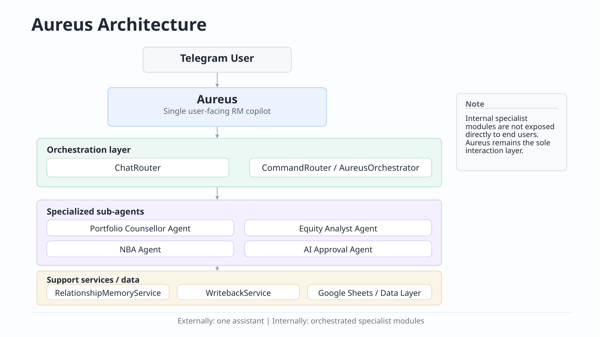

# Aureus RM Copilot

A Telegram-based copilot for relationship managers in private banking. Single orchestrated assistant — one consistent interface backed by specialized internal modules for client intelligence, equity research, portfolio suitability, and relationship memory.

**Current version:** V7 (production) | **175 tests passing**



---

## What This Is

Aureus is a command-driven assistant that gives RMs fast access to structured intelligence grounded in their live client data. It automates the data-retrieval and synthesis work that typically precedes a client call or meeting — pulling holdings context, interaction history, suitability constraints, and equity research into a single, consistently-formatted output.

All outputs are internal RM decision-support tools. Aureus does not place orders, generate regulated advice, or produce content for direct client distribution.

---

## What This Is Not

- **Not a trading system** — no orders placed or routed
- **Not a regulated investment advisor** — all outputs require RM review before use with clients
- **Not a general-purpose chatbot** — commands are scoped strictly to RM workflows

---

## Architecture

Aureus is a single orchestrated assistant. It presents one consistent copilot interface to the RM; internally, `AureusOrchestrator` routes each request to the appropriate specialist module based on command type. None of the internal modules are exposed directly — all interaction flows through Aureus.

```
Telegram User
      ↓
 ChatRouter           — NL intent resolution + session state (RelationshipMemoryService)
      ↓
 CommandRouter        — slash command dispatch + multi-turn argument collection
      ↓
 AureusOrchestrator   — routes to specialist module by command type
  ├─ PortfolioCounsellorAgent    (portfolio review, scenario analysis, fit checks)
  ├─ EquityAnalystAgent          (equity deep dives, catalyst analysis, thesis checks)
  ├─ NBAAgent                    (hybrid rule-based scoring + Claude narrative)
  └─ AIApprovalAgent             (deterministic eligibility logic + Claude memo rendering)
      ↓
 Support services
  ├─ RelationshipMemoryService   — session continuity, client context per RM
  ├─ WritebackService            — async, deduplication-safe Sheets write-back
  ├─ ClientService               — client data access (Sheets or mock)
  └─ ClaudeService               — Anthropic API wrapper; template fallback if unavailable
      ↓
 Google Sheets                   — system of record (live data backend)
```

**Design notes:**
- All RM interaction goes through Aureus — specialist modules are internal implementation details
- `AureusOrchestrator` requires Claude; the bot falls back to template responses if the API is unavailable
- Google Sheets is the current storage layer; mock mode runs without credentials
- `RelationshipMemoryService` is in-process; memory persists across requests within a session via Sheets write-back

See [docs/architecture.md](docs/architecture.md) for the full service map and data flow.

---

## Commands

### V2 — Client Intelligence

| Command | Usage | Purpose |
|---------|-------|---------|
| `/client_review` | `/client_review John Tan` | Full RM review: holdings snapshot, interactions, follow-ups, relationship health |
| `/portfolio_fit` | `/portfolio_fit John Tan D05.SI` | Evaluate whether a stock fits the client's mandate and portfolio |
| `/meeting_pack` | `/meeting_pack John Tan` | Full meeting prep: brief, talking points, agenda, suggested actions |
| `/next_best_action` | `/next_best_action John Tan` | Prioritised next actions based on portfolio state and interactions |

### V3 — Equity Research Plugin

| Command | Usage | Purpose |
|---------|-------|---------|
| `/earnings_deep_dive` | `/earnings_deep_dive NVDA` | Deep earnings analysis with model implications |
| `/stock_catalyst` | `/stock_catalyst TSM` | Near-term catalyst identification for a stock |
| `/thesis_check` | `/thesis_check AAPL` | Investment thesis validation against current data |
| `/idea_generation` | `/idea_generation John Tan` | Stock idea generation based on client mandate and deployable liquidity |
| `/morning_note` | `/morning_note DBS` | Morning briefing note for a ticker or sector |

### V3 — Wealth Management Plugin

| Command | Usage | Purpose |
|---------|-------|---------|
| `/portfolio_scenario` | `/portfolio_scenario John Tan` | Portfolio scenario analysis including CASA liquidity |

### V5.1 — Relationship Memory + Next Best Action

| Command | Usage | Purpose |
|---------|-------|---------|
| `/relationship_status` | `/relationship_status John Tan` | Full relationship snapshot: memory context, open items, NBA |
| `/overdue_followups` | `/overdue_followups John Tan` | Overdue follow-up actions for a client |
| `/attention_list` | `/attention_list` | Book-wide prioritised client list with NBA scoring |
| `/morning_rm_brief` | `/morning_rm_brief` | Daily morning briefing across the full book |
| `/log_response` | `/log_response John Tan interested NVDA` | Log client response and update relationship memory |

### V7 — AI Approval Agent

| Command | Usage | Purpose |
|---------|-------|---------|
| `/ai_assessment` | `/ai_assessment John Tan` | Generate a structured Accredited Investor eligibility assessment memo |

Supports criteria selection by number (`1`/`2`/`3`/`4`) or text (`income` / `net assets` / `financial assets`). If no criteria is provided, Aureus asks. See [docs/v7_ai_approval.md](docs/v7_ai_approval.md).

---

## Google Sheets Structure

The bot reads from and writes to a Google Spreadsheet with these tabs:

| Tab | Key Columns |
|-----|-------------|
| `Customers` | `customer_id`, `full_name`, `risk_profile`, `segment`, `relationship_status`, `attention_flag` |
| `Holdings` | `customer_id`, `ticker`, `security_name`, `portfolio_weight_pct`, `deployable_cash` |
| `Interactions` | `customer_id`, `interaction_date`, `channel`, `summary`, `follow_up_required` |
| `Watchlist` | `customer_id`, `ticker`, `security_name`, `reason_for_interest` |
| `Tasks_NBA` | `customer_id`, `action_title`, `urgency`, `status`, `due_date`, `nba_score` |

`customer_id` is the join key across all tabs. V5.1 adds relationship memory columns to `Customers` and `Tasks_NBA` — run `python scripts/bootstrap_v51_schema.py` to migrate a live sheet.

---

## Setup

### Prerequisites

- Python 3.11+ (or Docker)
- Telegram bot token (from [@BotFather](https://t.me/BotFather))
- Anthropic API key (from [console.anthropic.com](https://console.anthropic.com))
- Google Sheets spreadsheet + service account JSON (optional — bot runs in mock mode without it)

### Quick Start (Docker)

```bash
# 1. Copy and fill environment variables
cp .env.example .env
# edit .env: add TELEGRAM_BOT_TOKEN, ANTHROPIC_API_KEY, GOOGLE_SHEETS_SPREADSHEET_ID

# 2. Place Google service account credentials
cp your-service-account.json credentials/service-account.json

# 3. Build and run
docker compose up --build
```

The bot starts polling. Open Telegram, find your bot, and type `/start`.

### Quick Start (Python)

```bash
python3 -m venv venv && venv/bin/pip install -r requirements.txt
cp .env.example .env  # fill in values
venv/bin/python app.py
```

### Mock Mode

Leave `GOOGLE_SHEETS_SPREADSHEET_ID` empty or omit `service-account.json`. The bot starts in mock mode with sample client John Tan (CUST001). All commands work — responses are generated against mock data.

### Environment Variables

| Variable | Required | Description |
|----------|----------|-------------|
| `TELEGRAM_BOT_TOKEN` | Yes | From @BotFather |
| `ANTHROPIC_API_KEY` | Yes | From console.anthropic.com |
| `ANTHROPIC_MODEL` | No | Default: `claude-sonnet-4-6` |
| `GOOGLE_SHEETS_SPREADSHEET_ID` | No | Sheet ID from URL — omit to use mock mode |
| `GOOGLE_APPLICATION_CREDENTIALS` | No | Default: `credentials/service-account.json` |
| `APP_ENV` | No | `dev` or `prod` (default: `dev`) |
| `LOG_LEVEL` | No | `DEBUG`, `INFO`, `WARNING` (default: `INFO`) |

---

## Testing

```bash
# Full suite (175 tests)
venv/bin/python -m pytest tests/ -q

# Single file
venv/bin/python -m pytest tests/test_ai_approval_agent.py -v
```

Tests cover: AIApprovalAgent eligibility engine (67), NBAAgent scoring, WritebackService deduplication, ChatRouter NL resolution, FinancialAnalysisService, guardrail rules, mock data fixtures.

---

## V5.1 Schema Migration

If upgrading a live Google Sheet from V4/V5:

```bash
# V5.1 — relationship memory columns
venv/bin/python scripts/bootstrap_v51_schema.py

# V7 — AI_Assessment tab (create or add missing columns)
venv/bin/python scripts/bootstrap_v7_ai_fields.py
```

Both scripts are idempotent — safe to run on existing sheets. Existing data is never modified.

---

## Project Structure

```
aureus-rm/
├── app.py                          # Entry point — boots all services, starts bot
├── bot/
│   └── telegram_bot.py             # Telegram handler wiring (thin — no business logic)
├── services/
│   ├── aureus_orchestrator.py      # Routes to specialist agents, synthesises output
│   ├── portfolio_counsellor_agent.py
│   ├── equity_analyst_agent.py
│   ├── nba_agent.py                # Hybrid rule-based scoring + Claude narrative
│   ├── ai_approval_agent.py        # Deterministic AI eligibility engine + memo rendering
│   ├── relationship_memory_service.py  # Session continuity per client
│   ├── writeback_service.py        # Async Sheets write-back with dedup
│   ├── chat_router.py              # NL resolution + session continuity
│   ├── command_router.py           # 3-tier command dispatch
│   ├── client_service.py           # Client data access (Sheets or mock)
│   ├── sheets_service.py           # Google Sheets connector
│   ├── financial_analysis_service.py
│   ├── equity_research_service.py
│   └── claude_service.py           # Anthropic API wrapper
├── hooks/
│   ├── pre_response_guardrail.py   # Blocks prohibited language patterns
│   ├── source_validation.py        # Validates all data was fetched in-session
│   └── crm_logger.py               # Logs completed interactions
├── scripts/
│   ├── bootstrap_google_sheet.py   # Initial Sheets setup
│   ├── bootstrap_v51_schema.py     # V5.1 column migration
│   └── bootstrap_v7_ai_fields.py   # V7 AI_Assessment tab creation
├── tests/                          # 175 tests — mirrors services/ structure
├── schemas/                        # JSON Schema for output validation
├── docs/                           # Architecture, agents, version history, guardrails
├── .claude/                        # Claude Code integration (commands, skills, rules)
├── Dockerfile / docker-compose.yml
└── .env.example
```

---

## Guardrails and Compliance

Three Python hooks enforce compliance on every interaction:

- **`pre_response_guardrail.py`** — blocks responses containing prohibited language (buy/sell directives, guaranteed returns, risk-free claims, speculative price targets)
- **`source_validation.py`** — validates all cited data was fetched from an authorised source in the current session
- **`crm_logger.py`** — logs completed interactions to the CRM notes system

Compliance rules are defined in `.claude/rules/compliance.md`. See [docs/guardrails.md](docs/guardrails.md) for the full prohibited language list and escalation paths.

---

## Current Limitations

- **Google Sheets as storage** — no DB layer; query performance degrades at scale
- **No web UI** — all interaction via Telegram commands
- **Single data backend** — no external market data integration; equity research uses internal service layer
- **Schema migration required** — V5.1 columns must be bootstrapped before live relationship memory features work
- **Session continuity scope** — relationship memory is in-process; does not persist across bot restarts without Sheets write-back

---

## Version History

| Version | Key Changes |
|---------|-------------|
| V4 | CASA liquidity tracking, deployable cash in portfolio scenarios, Aureus Signature Output Style |
| V5 | AureusOrchestrator, Portfolio Counsellor Agent, Equity Analyst Agent, two-agent architecture |
| V5.1 | RelationshipMemoryService, NBAAgent, WritebackService, session continuity, attention list, morning RM brief, relationship status, overdue follow-ups, /log_response |
| V7 | AIApprovalAgent, Accredited Investor eligibility assessment, structured memo output, validation + confidence scoring, multi-turn criteria selection |

See [docs/versions.md](docs/versions.md) for the full milestone breakdown.

---

## Recommended Next Phase: V6 Workflow Agent

V6 is not yet built. The recommended next phase is a proactive workflow layer:

- Scheduled morning briefs pushed to the RM without a command trigger
- Proactive alerts on price moves, earnings, and relationship events
- Multi-client batch processing across the full book
- Persistent workflow state machine tracking open action items across sessions
- Calendar and CRM integration for richer context

See [docs/versions.md](docs/versions.md) for the V6 roadmap note.

---

## Security

| File | Status |
|------|--------|
| `.env` | Excluded by `.gitignore` — contains all secrets |
| `credentials/*.json` | Excluded by `.gitignore` — Google service account key |
| `.env.example` | Safe to commit — placeholders only |

Never commit `.env` or `credentials/service-account.json`.
